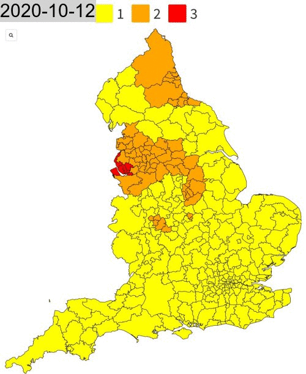

Since October, the UK's COVID-19 strategy has been defined by the government's **Lockdown Tier system**. Different regions, councils and cities have had their lockdowns change from **Tier 1 - Medium Alert** to the newly introduced **Tier 4 - Stay At Home**. Now everybody is in a national lockdown, but people all over the country continuously had trouble keeping track of what tier they were in, and what restrictions they had to abide with.

From a mapping perspective, what has this looked like? The website [Election Maps UK](https://electionmaps.uk/) has built constantly updated maps of the different Tiers as they evolved from October to now. You can find these on their Twitter account: @[ElectionMapsUK](https://twitter.com/ElectionMapsUK). Unfortunately, it can often be hard to remember how those Tiers shifted, and checking back through old tweets is a huge hassle.

Using R and the `rtweet` package, we can automate the digging **that would take hours in manually scrolling**. Then we can combine the photos together in a nice little GIF using `magick` and `magrittr` packages to share on our social channels as we remember *(or try to forget)* the last 4 months of COVID lockdown rules. 

First, let's load the necessary libraries and set the directory. In addition to the ones mentioned before, we also download `tidyverse` to help manipulate the data. Also, please set your working directory to the file location with `setwd()`!

```{r message = FALSE, warnings = FALSE}
if(!require("rtweet")) install.packages("rtweet")
if(!require("httpuv")) install.packages("httpuv")
if(!require("tidyverse")) install.packages("tidyverse")
if(!require("magick")) install.packages("magick")
if(!require("magrittr")) install.packages("magrittr")
```

##  <b> Scraping Twitter with rtweet </b>

`Rtweet` is a sweet package, with a lot of power to **connect with Twitter and then do whatever analytics you want**. The one requirement is that *you need* a Twitter account to read in tweets from the site. You should also note that we cannot just collect data without any limits, we are usually maxed out at 18,000 observations per 15 minutes.

Our first step is to read in a ton of tweets (let's say the last 2000) from @[ElectionMapsUK](https://twitter.com/ElectionMapsUK) and manipulate the data. Using the `get_timeline()` function, we can do just that. This creates a row for each tweet, with 90 columns that identify the different aspects of the tweet, like whether it contains media, urls, is a retweet, the text, etc. Then we want to subset for all the tweets with photos in it. Within those photo tweets, we see a common URL in the `urls_expanded_url` column that directs us to the [COVID tier map page on the Elections UK website](https://electionmaps.uk/covid19-tier-map). Using this web link we can filter out all the tweets that direct to that page on the website. 

If you need more help with the `rtweet` package and linking Twitter and your R console, see [the vignette here](https://cran.r-project.org/web/packages/rtweet/vignettes/intro.html). I should mention that you unfortunately cannot do the Donald Trump practice lesson anymore for reasons outside of any developer's control... 

Also if you get the error `Error: API did not return json`, you need to register your token into the environment (sometimes it occurs, sometimes it doesn't). I have included the necessary code below commented out. You can get all the required tokens from [Twitter's Developer Site](https://developer.twitter.com/en).
<br>
```{r message = FALSE, warnings = FALSE, eval=FALSE}
# First let's pull the last 2,000 tweets of data
electionmap_tweets <- get_timeline("ElectionMapsUK", n = 2000)

# After you input these things or use the get_timeline() function a browser window should appear and you can authenticate your twitter account. If you have trouble try registering your token through R
# token <-
#   rtweet::create_token(
#     app = "Application Name",
#     api_key = [your_api_key],
#     api_secret = [your_api_secret_key],
#     access_token = [your_access_token],
#     access_secret = [your_access_secret]
#   )
# Because I want to make this as easy for you as possible, I have also saved the data in a rdata file that you can download at my Github and I will call in now
load("tweets.rds")

# Then let's subset the tweets with photos in them in a new dataframe
em_photo_tweets <- electionmap_tweets %>% 
  subset(media_type=="photo")

# We then subset for the url we see in many different photos that we want to use
# "https://electionmaps.uk/covid19-tier-map"
em_tier_tweets <- em_photo_tweets %>% 
  mutate(urls_expanded_url = sapply(urls_expanded_url, toString)) %>% # need to turn it from a list to a character vector in order to filter
  filter(urls_expanded_url=="https://electionmaps.uk/covid19-tier-map")
```
<br>
Before downloading all the pictures, I notice that some of these photos aren't the Lockdown Tier maps I was initially looking for (Election Maps UK makes a ton of other great visualizations like election stats or case rates). Therefore we will need to filter for text containing the word **Tier** using the `grepl` function. 

Next let's actually pull out the images we want to turn into a GIF. To do this we can create a new dataframe with two columns, the date it was created and the image url. After we shorten the `Date` text to only include the actual day (and not the time), we can create a new folder with the `dir.create` function. Finally, we use a *for loop* to download each image as a jpg from the web address found from the twitter file. **This downloads 20 images just so you know!**
<br>
```{r message = FALSE, warnings = FALSE, eval=FALSE}
# Filter all the tweets that include Tier in it
em_tier_tweets <- filter(em_tier_tweets, grepl("Tier",text))

# When we create the new data frame we have to unlist the media_url column, turning 
# it from list to character 
images <- data.frame(Date = em_tier_tweets$created_at,
                     Image = unlist(em_tier_tweets$media_url))

# Cut the timing on the Date column
images$Date <- substr(images$Date, 1, 10)

# Create a folder for the images
dir.create("images")
for (i in 1:nrow(images)) { 
  row <- images[i,]
  download.file(images[i,2], destfile = paste0('images/TierMap_',images[i,1],'.jpg'), 
                mode="wb") 
}
# This downloads 20 images, so be aware!

# We notice that four images are not Tier Maps or have text over the maps, so let's just go ahead and delete those manually
file.remove(c("images/TierMap_2020-12-01.jpg", "images/TierMap_2020-12-15.jpg",
              "images/TierMap_2020-11-28.jpg", "images/TierMap_2020-12-22.jpg"))
```

## <b> Editing & Animating the Maps </b>

<br>
We are *almost* there!

Now that we have all the images, their dates and the will to make this into an animated graphic we will use the `magick` and `magrittr` packages to edit the images and combine them into an animated GIF. I **highly recommend** going to the [magick](https://cran.r-project.org/web/packages/magick/vignettes/intro.html) vignette to learn more about editing images in R, as this is one of the coolest packages I have used. 

First we create a vector of all the dates using the file names for each image in our folder. We then resize all the images to 500x750 so that none of the images are cropped unnecessarily and we use the `image_annotate` function to input the date of each of the images on the top left corner. We do this all in a new function called `imageResizerR` that was tweaked from [Ben Johnston's work here](https://www.ben-johnston.co.uk/bulk-resizing-images-with-r/). 
<br>
```{r message = FALSE, warnings = FALSE, eval=FALSE}
# Read in all the image names from your folder
# Create a vector with all the dates to be read onto each image
dates <- list.files("images") %>% 
  substr(9,18)

listOfFiles <- list.files(path = "images",
                          full.names = TRUE)
# Resize the images in bulk thanks to a function found here https://www.ben-johnston.co.uk/bulk-resizing-images-with-r/
imageResizeR <- function(z, a){
  listOfFiles <- list.files(path = z,
                            full.names = TRUE)
  imageResizing <- for(i in 1:length(listOfFiles)){
    imFile <- image_read(listOfFiles[i])
    resized <- image_scale(imFile, a)
    dated <- image_annotate(resized, dates[i], gravity = "northwest", size = 40, 
                            color = "black", boxcolor = "lightgrey")
    image_write(dated,
                paste(listOfFiles[i]))
  }
}

imageResizeR("images", "500x750")
```
<br>
After writing these files we can read in all the images from the folder, join them together, animate it at a pre-set speed (we choose 4 frames per second with a delay of 200ms, or 2 seconds). You can edit that however you want.
<br>
```{r message = FALSE, warnings = FALSE, eval=FALSE}
list.files(path="images", pattern = '*.jpg', full.names = TRUE) %>% 
  image_read() %>% # reads each path file
  image_join() %>% # joins image
  image_animate(fps=4, delay = 200) %>% # animates, can opt for number of loops
  image_write("TierMaps.gif") # write to current dir
```
<br>
And tada, you have a GIF of all the maps that you can call from your working directory!


<br>

Thanks for the read, hope it was helpful! A special shoutout to @[ElectionMapsUK](https://twitter.com/ElectionMapsUK) for the amazing Tier Maps over the past few months.

----------------------------------------------------------------------------------------------------------
References:
[1] ElectionMapsUK, [COVID 19 Tier Map (England)](https://electionmaps.uk/covid19-tier-map), (2020)
[2] Johnston, Ben, [Bulk Resizing Images With R & Magick](https://www.ben-johnston.co.uk/bulk-resizing-images-with-r/), (2018)

----------------------------------------------------------------------------------------------------------

*I am a Simulation & Strategy Consultant at Monitor Deloitte, I use stats and analytics to inform Digital Twin models that re-invent the way companies approach strategic decisions. In my free time, I'm obsessed with politics and policy, blogging about it all the time at [Policy In Numbers](policyinnumbers.com). You can find me there or at my [LinkedIn](https://www.linkedin.com/in/dylansjanderson/) and [Twitter](https://twitter.com/dylansjanderson) accounts (feel free to connect or give me a follow).*